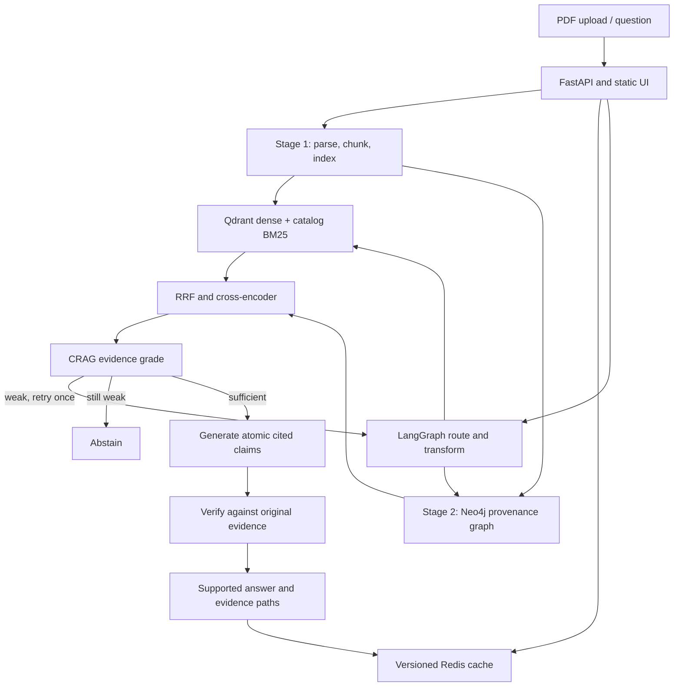

# EvidenceGraph-X

**Agentic, self-correcting Graph RAG with claim-level verified citations.**

EvidenceGraph-X is a compact AI engineering portfolio project for querying technical PDFs. It combines dense and lexical retrieval, a provenance-backed Neo4j graph, a bounded LangGraph correction loop, and an LLM verifier that removes unsupported answer claims. A plain JavaScript UI makes the source snippets, PDF pages, graph paths and runtime measurements inspectable.

**Start with [setup.md](setup.md).** All commands run from the project root. Actual delivered checks and remaining integration limits are listed in [VALIDATION.md](VALIDATION.md). The complete tree and per-file purpose/dependencies/usage are in [MANIFEST.md](MANIFEST.md).

## Problem and design

Technical QA often retrieves a topical paragraph without the facts needed to connect two concepts. A generator can then add plausible but unsupported details. Uploads and optional-service failures can also make a demo unusable. This project makes Stage 1 searchable before graph enrichment finishes, fuses complementary retrieval rankings, grades evidence before generation, and checks every returned atomic claim against its cited original chunk.

The code is intentionally small enough to explain in an undergraduate interview: nine backend Python files, three evaluation scripts, one test module and three static UI files. Models run through CPU ONNX or an external API; a local large language model and CUDA are unnecessary.

## Architecture



## Implemented workflow

- **Two-stage ingestion:** SHA-256 deduplication, page-grounded PDF parsing, paragraph parents, sentence/word windows, contextual prefix embeddings and indexing, followed by background graph enrichment. The UI polls real persisted progress every three seconds.
- **Original vs contextual evidence:** raw text and contextual representations remain separate. Qdrant stores named `raw` and `contextual` vectors so contextual-retrieval ablations actually change what is searched. Tables are kept atomic; actual bounding boxes are retained when the parser supplies them.
- **Retrieval:** independently callable dense and BM25 search, document/metadata filtering, reciprocal rank fusion and optional FlashRank cross-encoder reranking. Qdrant local storage is the default; Qdrant Cloud is supported. Dense/sparse and graph branches can run concurrently.
- **Graph:** structured extraction with Pydantic validation and one retry, scoped entities, relation quotes that must occur in original chunks, Document/Section/Chunk/Entity/Community nodes, and PART_OF/MENTIONS/RELATES_TO relationships. Parameterized Cypher performs bounded one/two-hop expansion; NetworkX Personalized PageRank ranks candidate support. Every returned graph edge retains its supporting chunk.
- **Global questions:** scan selected corpus chunks and optional community summaries in map groups, select supporting originals, then generate from the budgeted evidence. Failed groups are surfaced as incomplete coverage. This is more expensive than local retrieval and does not guarantee an exhaustive summary.
- **Routing and correction:** factoid, multi-hop, global and off-scope routes; conditional decomposition; optional HyDE for short queries; one rewrite/step-back retry after weak evidence. The loop cannot retry indefinitely. Router decisions are logged.
- **Generation and trust:** evidence-only JSON atomic claims, retrieved chunk IDs, rendered `[Document, p.X]` citations, and entailment/partial/contradiction/insufficient classifications. The application retains only entailed claims in normal operation. A verifier outage removes unverified claims. The UI exposes all verdicts.
- **Cache:** bounded Redis list, exact repeat matching and opt-in cosine semantic matching. Corpus and relevant configuration versions scope keys; graph completion changes the version. Redis failure leaves normal answering available.
- **Observability:** actual per-node durations, Stage 1/2 timings, cache hits/misses, retries, calls, provider token counts, optional paid-price estimates and categorized failures in SQLite.

## Stack and practical changes from the report

| Layer | Implementation | Reason |
|---|---|---|
| API / UI | FastAPI, HTML/CSS/JavaScript | Small repository and inspectable browser flow. |
| Orchestration | LangGraph StateGraph | Explicit nodes, conditional edges and bounded correction. |
| Parsing | PyMuPDF default; optional Docling | Fast, light first run; richer layout adapter available without forcing Torch onto every install. |
| Embeddings | FastEmbed BGE small, configurable | CPU ONNX inference; no GPU requirement. |
| Hybrid index | Qdrant named dense vectors + local BM25 + Python RRF | Exact terminology and semantic matches; simple independent ablations. BM25 is not falsely described as Qdrant sparse-vector storage. |
| Graph | Neo4j + NetworkX | Aura Free compatibility; no paid GDS/APOC requirement. |
| Communities | Greedy modularity + LLM summaries | Avoids igraph/Leiden native dependencies for a small corpus. |
| Reranking | FlashRank TinyBERT default | Lightweight cross-encoder; configurable BGE-class alternatives. |
| Inference | Groq OpenAI-compatible HTTP API | API-based models fit a 4 GB VRAM development laptop. |
| Evaluation | Custom metrics + optional current RAGAS collections API | Retrieval metrics do not depend on an LLM judge. |
| Deployment | Docker; Oracle Always Free VM + Caddy | Current HF Docker Space creation requires a paid plan. |

Current availability was checked on **2026-10-03**. The report's Llama 3.1 8B/3.3 70B Groq IDs were retired from free/developer tiers; configurable GPT-OSS 20B/120B replacements are used. Verify account-specific availability with `python -m eval.evaluate --check-services`.

The current RAGAS 0.4.3 package imports integrations removed in LangChain Community 0.4.2. Optional requirements therefore pin Community 0.4.1. The evaluator uses `ragas.metrics.collections` and `llm_factory`, rather than the deprecated metric imports. Optional Docling dependencies use explicit CPU Torch/TorchVision wheels on Windows/Linux x86.

Useful primary references:

- [Groq models](https://console.groq.com/docs/models) and [deprecations](https://console.groq.com/docs/deprecations)
- [Qdrant pricing](https://qdrant.tech/pricing/) and [Python client](https://github.com/qdrant/qdrant-client)
- [Neo4j Aura Free FAQ](https://neo4j.com/cloud/platform/aura-graph-database/faq/) and [driver transactions](https://neo4j.com/docs/python-manual/current/transactions/)
- [Upstash Redis pricing](https://upstash.com/pricing/redis)
- [LangGraph Graph API](https://docs.langchain.com/oss/python/langgraph/graph-api)
- [Docling usage](https://docling-project.github.io/docling/usage/)
- [FastEmbed models](https://qdrant.github.io/fastembed/examples/Supported_Models/) and [FlashRank](https://github.com/PrithivirajDamodaran/FlashRank)
- [RAGAS](https://docs.ragas.io/en/stable/) and [current metric source](https://github.com/vibrantlabsai/ragas)
- [Hugging Face Spaces overview](https://huggingface.co/docs/hub/spaces-overview)
- [Oracle Always Free limits](https://docs.oracle.com/en-us/iaas/Content/FreeTier/freetier_topic-Always_Free_Resources.htm)
- [Docker Ubuntu installation](https://docs.docker.com/engine/install/ubuntu/), [Caddy HTTPS](https://caddyserver.com/docs/automatic-https), [sslip.io/nip.io](https://sslip.io/)

## Evaluation corpus

Download official PDFs with `python -m eval.evaluate --download-corpus`. Exact source hashes and filenames are in `eval/corpus.json`. Page counts below are physical PDF pages verified during dataset construction. No PDFs are redistributed in the repository. Refer to each source's applicable reuse terms, including any third-party content.

| Document | Official PDF | Pages | Why selected |
|---|---|---:|---|
| IETF RFC 9110: HTTP Semantics | [RFC Editor](https://www.rfc-editor.org/rfc/rfc9110.pdf) | 194 | Normative method semantics, status codes and cross-references. |
| IETF RFC 9000: QUIC | [RFC Editor](https://www.rfc-editor.org/rfc/rfc9000.pdf) | 151 | Transport state machines, security and flow control. |
| NIST AI RMF 1.0 | [NIST](https://nvlpubs.nist.gov/nistpubs/ai/NIST.AI.100-1.pdf) | 48 | Risk concepts and cross-cutting functions. |
| NIST Generative AI Profile | [NIST](https://nvlpubs.nist.gov/nistpubs/ai/NIST.AI.600-1.pdf) | 64 | Interrelated risks and mitigation tables. |
| NIST CSF 2.0 | [NIST](https://nvlpubs.nist.gov/nistpubs/CSWP/NIST.CSWP.29.pdf) | 32 | Function/profile relationships. |
| NASA Systems Engineering Handbook Rev 2 | [NASA](https://www.nasa.gov/wp-content/uploads/2018/09/nasa_systems_engineering_handbook_0.pdf) | 297 | Long engineering processes, lifecycle distinctions and appendices. |

The application accepts arbitrary valid text PDFs within configured limits. Evaluation is tied to the exact annotated editions and filenames.

## Evaluation and ablation

The 120-record set has 48 single-hop, 48 compositional multi-hop and 24 unanswerable controls. Source answers/pages were anchored during construction, but **human validation remains pending**. The included 12-record manual-audit form has no invented reviewer judgments. See [eval/DATASET.md](eval/DATASET.md) for audit procedure, relevance definitions and limitations.

```powershell
python -m eval.evaluate --allow-unreviewed
python -m eval.ablation --allow-unreviewed
python -m eval.ablation --graph-only --allow-unreviewed
python -m eval.latency
```

Ablations: dense, sparse, hybrid, contextual hybrid, reranker, graph, graph plus CRAG, and full system with transforms/verifier/cache. Raw vs contextual dense representations are separately indexed. Graph-only comparison holds other feature switches constant. Full-system caching logs cold and repeated requests separately. Optional `--ragas` supplies independent judge metrics after installing `requirements-eval.txt` and configuring its judge.

Retrieval: Recall@5/10, MRR, nDCG@10, Hit@5/10. Trust: verifier support rate, retrieved-ID citation precision and abstention accuracy. System: p50/p95 durations, cache rate, provider tokens and optional paid-price estimates. Graph: multi-hop retrieval metrics, faithfulness where judged, and structural/provenance Evidence Path Validity. Outputs include CSV/JSON, response traces and readable reports with failure categories and 95% question-bootstrap confidence intervals.

| Delivered benchmark | Result |
|---|---|
| Recall@5, Recall@10, MRR, nDCG, Hit@k | NOT MEASURED |
| Faithfulness, relevancy, context precision/recall | NOT MEASURED |
| Claim support / citation precision / abstention accuracy | NOT MEASURED |
| Corpus latency, cache rate, cost and graph contribution | NOT MEASURED |

The report's previous 10-query baseline (Recall@5 81.7%, Recall@10 90.8%, MRR 0.717) is historical information, **not a result of this repository**, and is not directly comparable to this dataset. No target numbers are copied into generated results.

After a full label audit, `--baseline PATH --tolerance 0.02` compares new measured retrieval results with a saved measured summary from the identical dataset/options. It rejects unaudited, missing or errored results. CI runs tests, structural dataset validation and Docker build; its optional manual benchmark requires secrets and consumes quota.

## Latency, cost and failures

SQLite events record real work. Node times are inclusive, so total latency is not the sum of all parent/substage durations. Cache-hit queries include retrieval-free timings; cold and warm experiment behavior is visible in saved responses. Free quota does not establish zero paid-equivalent cost. Configure current per-million input/output prices separately for small and large models to calculate an estimate; leave them blank to keep estimates unmeasured.

Failure reports distinguish parsing, chunking, entity/relation extraction, retrieval, graph traversal, reranking, generation, citation and verification events. Neo4j failure falls back to hybrid, Redis failure disables caching, reranker failure retains fused ranking, graph extraction failure leaves Stage 1 searchable, and malformed uploads fail independently. RAGAS judge billing/usage is separate from application telemetry.

## Local run, API and deployment

Follow the Windows PowerShell instructions in [setup.md](setup.md). The recommended first-run command is `python -m app.main`; browse http://localhost:7860. Groq generation credentials are required for actual LLM answers. The application can start without them and returns explicit abstention rather than synthetic answers.

| Endpoint | Purpose |
|---|---|
| `GET /` | Static UI. |
| `GET /health` | Liveness/configuration summary; no secrets. |
| `POST /upload` | Validated, size-limited multipart PDF upload. |
| `GET /documents` | Document stages and metadata. |
| `POST /query` | `question` and optional `document_ids`; citations and verification response. |
| `GET /document/{id}` | Original PDF when present. |
| `GET /document/{id}/status` | Persisted ingestion progress. |
| `GET /metrics` | Measured latency/cost/cache/failure summaries. |

When `API_TOKEN` is set, protected endpoints require `Authorization: Bearer …`. The UI retains the token only in its current page input. Ingestion/evaluation are local Python APIs for feature switches; the public query endpoint cannot disable verification.

Docker Compose runs one app process and a persistent data volume. The deployment Compose file adds Caddy HTTPS. The full free deployment procedure uses current OCI A1 limits (2 OCPUs, 12 GB), with regional availability/account verification and idle reclamation limitations. It does not claim Docker Spaces are free. Managed Qdrant/Neo4j/Upstash can remain external. A public deployment has not been performed without your service credentials.

## Screenshot

Screenshot placeholder: capture the running UI after a real, credentialed PDF question for your portfolio, including answer, source snippet and claim verdict. No simulated successful answer screenshot is included. Browser visual verification remains pending as recorded in VALIDATION.md.

## Limitations and future improvements

- LLM grading, extraction and entailment verification are fallible; the labels and claims need independent review before strong accuracy claims.
- The provisional dataset has correlated/compositional pairs and easy unanswerable controls. Some pairs share a page and do not establish a difficult graph benchmark. Improve these after human audit.
- Parsing is heuristic in lean mode; scanned pages require external OCR. Docling's richer adapter is optional. Cross-page Docling objects trigger per-page PyMuPDF fallback so whole cross-page text is not attached to one citation page; inspect original pages.
- The graph is document-scoped. It does not assert identity or relations across arbitrary documents, and it only verifies relation quotes exist, not that extraction is semantically perfect.
- Communities use greedy modularity rather than Leiden. Global map scanning can consume many calls and final evidence is context-budgeted; coverage is not guaranteed exhaustive.
- Progress uses polling, not SSE. Generation is returned after completion, not streamed token-by-token. LangGraph state is per request; durable checkpoints and distributed job queues are not implemented. Incomplete uploads resume from persisted catalog state on restart.
- BM25 depends on the local catalog. Committed cloud Qdrant payloads can restore it on an empty ephemeral host; original PDFs and telemetry require separate backups or re-upload. Partial cloud writes are not treated as published documents.
- Semantic cache matching is approximate and opt-in. Exact matching is safer for technical distinctions and numbers.
- This is a single-worker, shared-corpus portfolio application with an optional shared API token. It has no per-user isolation, PDF malware sandbox, deletion UI, or production-grade distributed rate limiting.
- Full credentialed benchmarks, live Neo4j/Redis integration, actual Docker execution and a public deployment must be validated in your environment. See the exact validation record.

Useful extensions: audited bridge-entity questions, document/fact-cluster bootstrap intervals, table/figure page highlighting, stronger relation resolution, job resumption/checkpointing, SSE/token streaming, independent claim judges and per-user isolation. Add these when measurements show they solve a real limitation.
