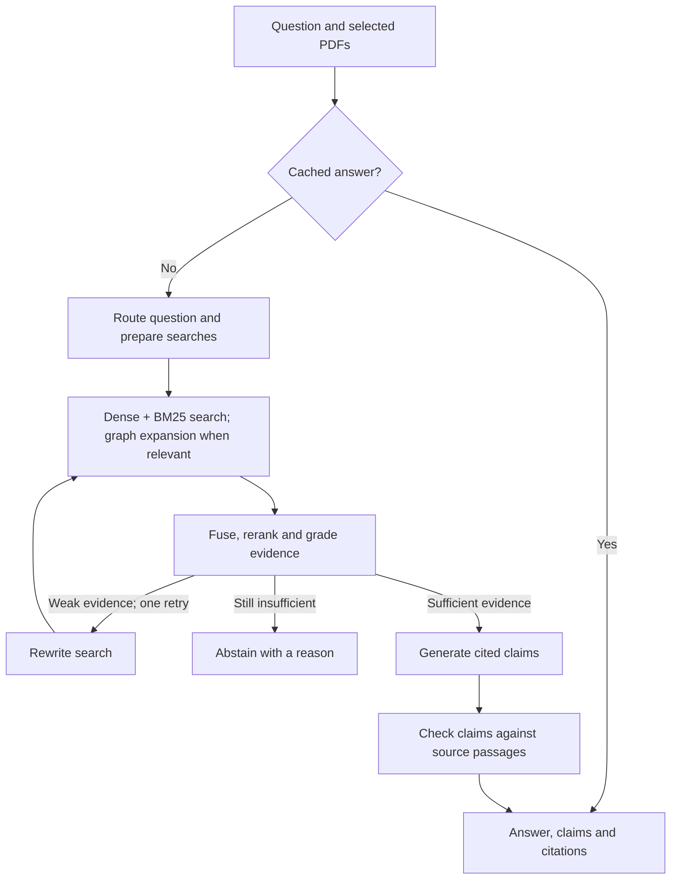

# EvidenceGraph-X

Ask a question about a PDF and see the evidence behind the answer. EvidenceGraph-X combines text search, semantic search and a document graph to help find related facts, then checks generated claims against their cited source passages.

**Live demo:** [evidencegraphrag-x.onrender.com](https://evidencegraphrag-x.onrender.com)  
**Repository:** [Bunnnyyy2005/evidencegraphRAG-x](https://github.com/Bunnnyyy2005/evidencegraphRAG-x)

## Try it

1. Open the demo and upload a small, text-based PDF. No dashboard access token is required.
2. Wait until the document is **Searchable**. Graph enrichment can continue in the background.
3. Ask a specific question, then expand the evidence and open a citation to check its PDF page.
4. Refreshing or leaving clears the visible source list. Stored documents remain on the server; re-upload a PDF to use it in a new visit.

If several PDFs are visible, select the ones you want to search. With none selected, the dashboard uses the searchable PDFs uploaded during that visit. An empty source list cannot search the older corpus through the dashboard. This is a shared public demo, not a private document workspace.

## How it works

### Upload and preparation

The backend validates the PDF and computes a content hash to avoid duplicate ingestion. PyMuPDF extracts page-grounded text, which is divided into smaller passages while retaining section and parent context. FastEmbed creates raw and contextual vectors for Qdrant; the local catalog supports BM25 search. The document becomes searchable before the graph is complete.

Background graph enrichment extracts entities and relationships, records their source passages in Neo4j, and creates community summaries. Saved checkpoints allow completed extraction steps to be reused when graph work resumes. Provider quotas can pause this stage without making an indexed document unsearchable.

### Question and answer



The router distinguishes factual, relationship, global and off-scope questions. Retrieval merges semantic and lexical matches using reciprocal rank fusion. Relevant relationship questions can also use bounded graph traversal. A cross-encoder reranks candidate passages, and evidence grading can trigger one corrective search.

Generation uses the retrieved evidence and returns claims with chunk citations. The verifier checks those claims against their source passages and removes unsupported claims. The dashboard shows the remaining answer, verification verdicts, evidence and timing. These checks are useful safeguards, but they can still make mistakes—inspect the original PDF when accuracy matters.

Redis stores versioned responses for repeated questions. Exact cache matching is the default; semantic matching is optional. Global questions may require many more model calls than a specific factual question.

## Stack

| Part | Tools |
|---|---|
| Backend and dashboard | FastAPI, HTML, CSS, JavaScript |
| Workflow | LangGraph |
| PDF parsing | PyMuPDF; optional Docling adapter |
| Embeddings and retrieval | FastEmbed BGE small, Qdrant, BM25, reciprocal rank fusion |
| Reranking | FlashRank |
| Graph | Neo4j, NetworkX |
| Generation and verification | Groq-hosted models; configurable GPT-OSS 20B and 120B defaults |
| Cache | Redis / Upstash |
| Evaluation | Retrieval metrics, saved response review, optional RAGAS judge |
| Deployment | Docker on Render with managed database services |

## Evaluation so far

The evaluation is **exploratory**, with human label and answer review still pending. A 120-question run was saved, but provider rate limits affected many responses. It should not be treated as a clean final accuracy benchmark.

| Measurement | Observed result | Scope |
|---|---:|---|
| Recall@10 / MRR | 0.7604 / 0.5269 | Earlier exploratory report, 96 questions |
| RAGAS answer relevancy | 0.9131 | Three successfully generated HTTP answers |
| RAGAS context precision / recall | 0.6708 / 1.0000 | Same three answers |
| RAGAS faithfulness | 1.0000 | One answer |
| Mean / P50 / P95 latency | 23.77 / 13.77 / 48.79 seconds | 120 records, including rate-limit-affected responses |
| Deployed graph query | 23.64 seconds; 3.03 seconds graph retrieval | One smoke test |

Small judge samples do not establish overall accuracy. Human-reviewed correctness, semantic citation correctness, clean graph/reranking comparisons and measured cost savings remain pending. No unmeasured scores are presented as results. See [EVALUATION_STATUS.md](EVALUATION_STATUS.md) for the recorded values and limitations.

For the controlled pilot, see [CONTROLLED-EVALUATION.md](CONTROLLED-EVALUATION.md). The runner saves progress and pauses on long quota errors rather than counting those errors as completed answers. Saved results are excluded from Git; keep a separate backup. The included source corpus and provisional question set are described in [eval/DATASET.md](eval/DATASET.md).

## Run locally

Use Python 3.12 and run these commands from the repository root:

```powershell
python -m venv .venv
.\.venv\Scripts\Activate.ps1
python -m pip install -r requirements.txt
Copy-Item .env.example .env
```

Fill in `.env` with your own Groq and database credentials, then start the application:

```powershell
python -m app.main
```

Open [localhost:7860](http://localhost:7860). Never commit `.env` or enter provider credentials into the public dashboard. Detailed configuration is available in [setup.md](setup.md); its older deployment walkthrough describes a different hosting option. The current live demo uses Render as described below.

## Deployment notes

The Render service builds the repository's Dockerfile and serves the app on port 7860. `/health` reports liveness and configuration; use `python -m eval.evaluate --check-services` in the configured environment to check external-service connectivity.

The live deployment uses Qdrant Cloud, Neo4j and Redis alongside Groq inference. Dashboard token entry has been removed for this public demo; `API_TOKEN` must be absent from Render's environment. Keep provider and database credentials in server environment variables. Public callers share the deployment's resources and provider quotas; this app does not implement user accounts or private document isolation.

The 512 MB instance exceeded its memory limit during embedding. The current patch uses smaller embedding batches and restores cloud payloads to SQLite in bounded batches. The deployment settings used for this profile are:

```text
EMBEDDING_BATCH_SIZE=2
EMBEDDING_THREADS=1
OMP_NUM_THREADS=1
OPENBLAS_NUM_THREADS=1
TOKENIZERS_PARALLELISM=false
```

These changes reduce memory demand; they are not a guarantee that every PDF or concurrent workload fits within 512 MB. Avoid changing the embedding model for an existing vector collection without rebuilding its index. Free-host restarts can lose local PDFs and telemetry; committed Qdrant payloads can restore the search catalog, but original PDF files may need re-uploading.

## Main endpoints

| Endpoint | Purpose |
|---|---|
| `GET /health` | Configuration and liveness summary |
| `POST /upload` | Upload a PDF |
| `GET /documents` | Read document stages |
| `POST /query` | Ask a question scoped to document IDs |
| `GET /document/{id}` | Open an available original PDF |
| `POST /document/{id}/resume-graph` | Resume graph enrichment from saved chunks |
| `GET /metrics` | Read recorded usage, timing and failures |

## What still needs work

Finish the controlled evaluation and human review, compare graph retrieval on completed graphs, expand judge coverage, and measure cost savings against a matched baseline. Scanned PDFs need OCR, graph extraction remains fallible, and the public demo needs stronger isolation and resource controls before production use.
